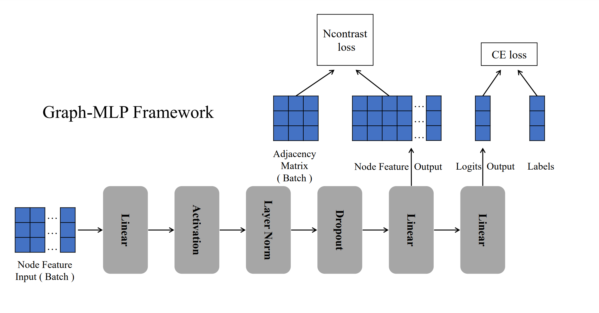
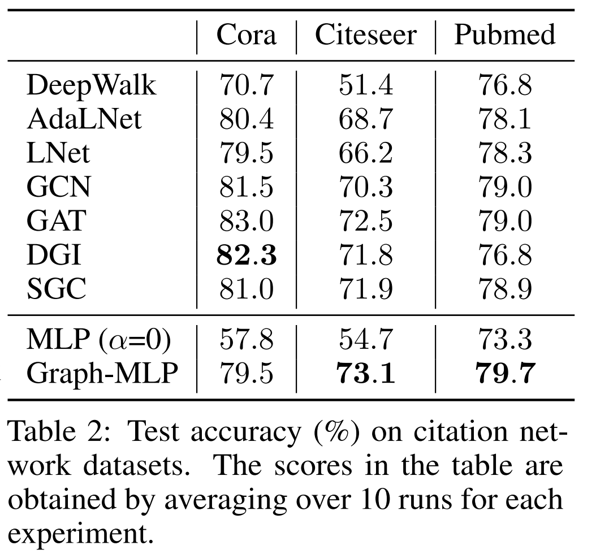

# Graph-MLP: Node Classificationwithout Message Passing in Graph

PyTorch implementation of Graph-MLP: Node Classification without Message Passing in Graph.

For more introduction to Graph-MLP, see:

TBD link





## Requirements

  * PyTorch **1.7**
  * Python 3.7

## Usage

```
## cora
python3 train.py --lr=0.001 --weight_decay=5e-3 --data=cora --alpha=10.0 --hidden=256 --batch_size=2000 --order=2 --tau=2

## citeseer
python3 train.py --lr=0.001 --weight_decay=5e-3 --data=citeseer --alpha=1.0 --hidden=256 --batch_size=2000 --order=2 --tau=0.5

## pubmed
python3 train.py --lr=0.1 --weight_decay=5e-3 --data=pubmed --alpha=100 --hidden=256 --batch_size=2000 --order=2 --tau=1
```
or

```bash run.sh```

## Cite

Please cite our paper if you use this code in your own work:

```
TBD
```